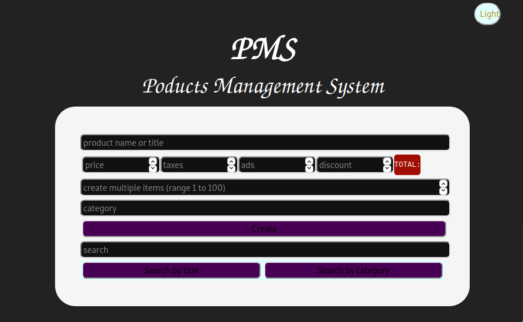
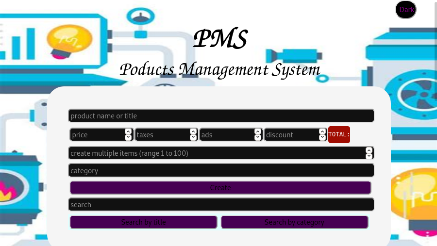
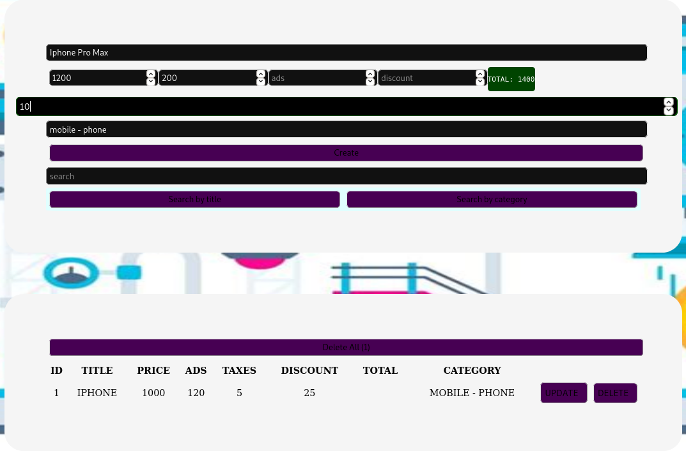
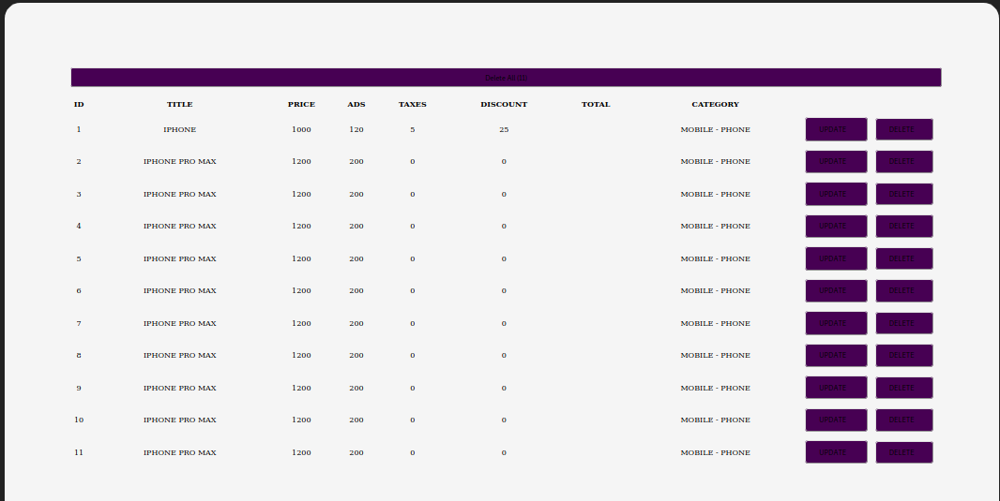

<link rel="stylesheet" type="text/css" href="static/css/readme-style.css">

# PRODUCT MANAGEMET SYSTEM

A responsive web application created by using HTML, CSS, and JS, it is a simple   
but attractive __*Product Management System*__ or  __*Product Management Panel*__.

## Features

+ A semantic structure that contains two diffrent sections.  

+ A responsive system with a beautifl design.  

+ Ability to input or pass a variety of data in additon of product's  
  name and price, for example, the discount's amount or taxes.  

+ Ability to create either a one or multiple product in a single  
  process and with the same data.

+ Data validation: a new record is will not be stored in the storage  
  unless all the data are valid and accepted, and also with a minimal  
  set of data that includes the "title", "price", and "category".  
  In addition, during the creation process, the user must not exceed  
  the maximum number of products (which equal to 100 products).  

+ Storing data automatically in the local storage.  

+ Searching items or products either by title or category.  

+ Displaying the stored records in a table with a very consistent  
  structure.  

+ Flexible mechanism for updating and deleting products.  

+ Provide diffrent customiztion mode (dark and light mode) 

<small>Note:  This application does not implement a backed system  soltution, in fact, it depends on the browser local storage to handle 
all the CRUD or data related operations.</small>

### Screenshots

<bt/>
<bt/>
<bt/>
<bt/>

